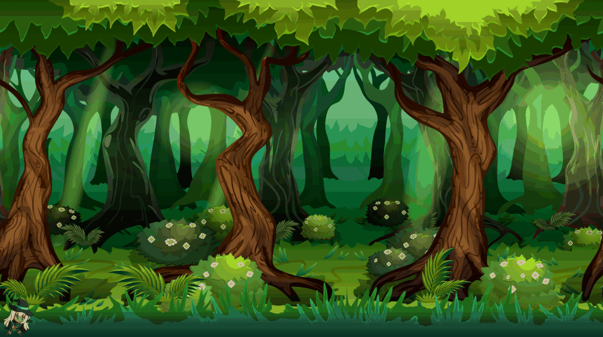

	

	

<h3 align="center">
  A simple endless runner game made in Javascript 🎲
</h3>

	

	
	<a href="https://guilhermebkel.github.io/endless-runner-game">Online Demo</a>

## 📌 Overview

A simple endless game made during the **ImersaoGameDev** from **Alura**, to understand the basics about game rendering, sounds, and much more using Javascript.

## 🔧 Technologies

- P5.js
